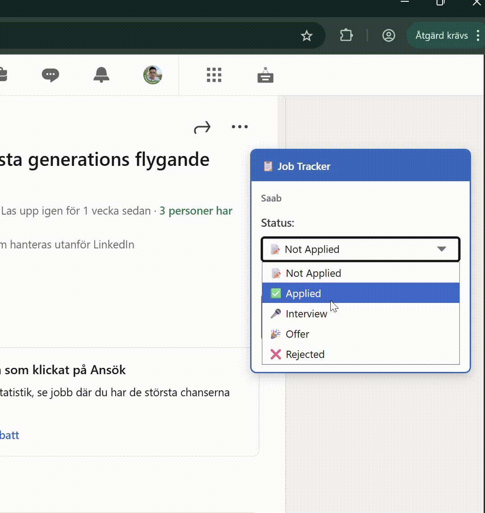
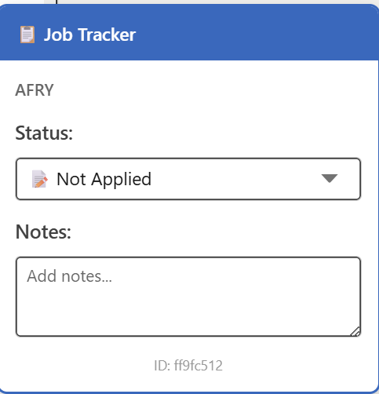
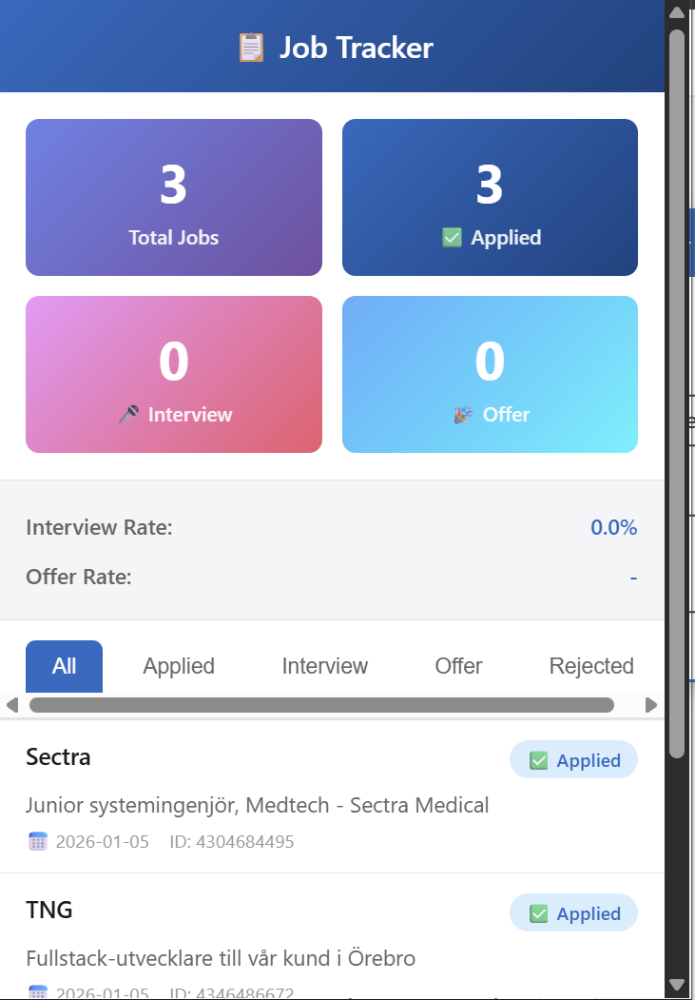

# LinkedIn Job Tracker

A free Chrome extension to track your job applications on LinkedIn.

## Features

- **Track Status** - Mark jobs as Applied, Interview, Offer, or Rejected
- **Add Notes** - Save important details about each application
- **View Dashboard** - See all your applications in one place
- **Export Data** - Download your tracking data as CSV
- **Privacy First** - All data stays on your device

## Installation

1. Download the [latest release](https://github.com/elinik0108/linkedin-job-tracker/releases)
2. Extract the ZIP file
3. Open Chrome and go to `chrome://extensions/`
4. Enable "Developer mode" (top right)
5. Click "Load unpacked" and select the extracted folder

## Usage

1. Visit any LinkedIn job posting
2. Use the overlay on the right to track the job
3. Click the extension icon to view your dashboard
4. Export your data anytime with the "Export CSV" button

## Screenshots

### Tracking Jobs

### Dashboard

## Contributing

Found a bug? Have a feature request? [Open an issue](https://github.com/elinik0108/linkedin-jobTracker-extension-chrome/issues).

Pull requests are welcome!

## License

MIT License - see [LICENSE](LICENSE) file.

## Support

⭐ If this extension helped you, please star this repo!

---

Made with ❤️ for job seekers everywhere
